# 🎯 Morse Code Master - Premium Android Application

<p align="center">
  
  
  
  
</p>

<p align="center">
  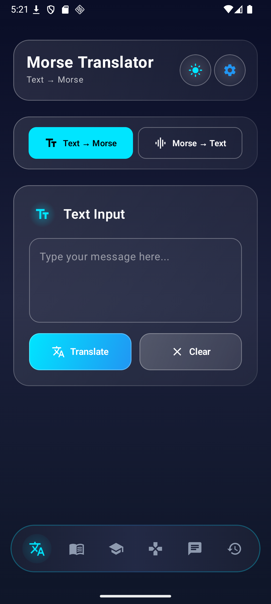
</p>

<h1 align="center">⚡ Master Morse Code with AI-Powered Learning ⚡</h1>

<p align="center">
  <strong>A comprehensive, feature-rich Android application for Morse code translation, learning, and practice, built with modern Android development practices.</strong>
</p>

---

## 🚀 **DOWNLOAD NOW**

<p align="center">
  <a href="https://play.google.com/store/apps/details?id=com.kreggscode.morsecode">
    
  </a>
</p>

<p align="center">
  <a href="https://kreggscode.github.io/Morsecode-AI-Android/">
    
  </a>
  <a href="https://kreggscode.github.io/Morsecode-AI-Android/privacy.html">
    
  </a>
</p>

---

## 🛠️ **Built with Modern Technologies**

<p align="center">
  
  
  
  
</p>

<p align="center">
  
  
  
  
</p>

---

## ✨ **Key Features**

### 🔤 **Advanced Translator**
- **Bidirectional Translation**: Convert text ↔ Morse code instantly
- **Visual Morse Display**: Animated dots and dashes with pulsing effects
- **Audio Playback**: Hear Morse code with adjustable speed (0.5x - 2.0x)
- **Flashlight Signaling**: Flash Morse code using device LED
- **Multiple Encryption Methods**:
  - 🔐 Caesar Cipher
  - 🔄 Reverse Encryption
  - 🔑 Custom Key Encryption
  - ⚡ Combined Methods
- **💾 Save & Share**: Store translations in history and share with others

### 🎤 **Voice Recognition**
- **Speech-to-Text**: Convert spoken words to Morse code
- **Real-time Audio Visualization**: Live audio level indicators
- **Instant Results**: See text as you speak
- **Auto-save**: Automatic history storage

### 📚 **Interactive Learning**
- **Complete Alphabet**: A-Z, 0-9, punctuation & special characters
- **Audio Examples**: Tap any character to hear its Morse code
- **Progress Tracking**: Monitor learning achievements
- **Quiz System**: Test knowledge with interactive challenges
- **Achievement Badges**: Track learned characters and scores

### 🎮 **Engaging Games**
Four exciting game modes for mastering Morse code:

1. **🎧 Morse Decoder**: Listen and identify characters
2. **⚡ Speed Challenge**: Translate under time pressure
3. **🧠 Memory Match**: Match patterns and letters
4. **🚨 SOS Rescue**: Decode emergency messages

### 🤖 **AI Assistant**
- **Expert AI**: Powered by Pollinations AI (OpenAI-compatible)
- **Morse Code Specialist**: Deep knowledge of history and applications
- **Contextual Chat**: Remembers conversation history
- **Free Access**: No API key required

### 🎨 **Beautiful Design**
- **Material Design 3**: Latest Android design system
- **Dark/Light Themes**: Automatic theme switching
- **Smooth Animations**: Fluid transitions and effects
- **Customizable UI**: Adjust colors and preferences

### 📱 **Advanced Features**
- **Offline Functionality**: Core features work without internet
- **Local Database**: Room persistence for all data
- **Background Processing**: Efficient coroutines implementation
- **Accessibility**: Screen reader support and large text options

## Features

### 🔤 Translator
- **Bidirectional Translation**: Convert text to Morse code and vice versa
- **Visual Morse Display**: Animated dots and dashes with pulsing effects
- **Audio Playback**: Hear Morse code with adjustable speed (0.5x - 2.0x)
- **Flashlight Signaling**: Flash Morse code using device LED
- **Encryption Support**:
  - Caesar Cipher
  - Reverse Encryption
  - Custom Key Encryption
  - Combined Encryption Methods
- **Save & Share**: Save translations to history and share with others

### 🎤 Voice Input
- **Speech Recognition**: Convert spoken words to Morse code
- **Real-time Feedback**: Visual audio level indicators
- **Partial Results**: See text as you speak
- **Auto-save**: Automatically saves voice translations to history

### 📚 Learn
- **Interactive Alphabet Chart**: Tap any character to hear its Morse code
- **Multiple Categories**:
  - Letters (A-Z)
  - Numbers (0-9)
  - Punctuation & Special Characters
- **Progress Tracking**: Monitor your learning progress
- **Quiz Mode**: Test your knowledge with interactive quizzes
- **Achievement System**: Track learned characters and quiz scores

### 🎮 Games
Four engaging game modes to practice Morse code:

1. **Morse Decoder**: Hear Morse code and guess the character
2. **Speed Challenge**: Translate as fast as possible
3. **Memory Match**: Match letters with Morse patterns
4. **SOS Rescue**: Decode emergency messages

Features:
- Three difficulty levels (Easy, Medium, Hard)
- Score tracking and high scores
- Timed challenges
- Progress feedback

### 🤖 AI Chat Assistant
- **Pollinations AI Integration**: Powered by OpenAI models
- **Specialized Knowledge**: Expert on Morse code, history, and cryptography
- **Conversation History**: Persistent chat storage
- **Context-Aware**: Remembers conversation context
- **Topics Covered**:
  - Morse code usage and history
  - Samuel Morse biography
  - Encryption techniques
  - Practical applications

### 📜 History
- **Complete Translation Log**: All translations automatically saved
- **Search & Filter**: Find translations quickly
- **Favorites**: Star important translations
- **Replay**: Play audio or flash any saved translation
- **Export**: Share or export history
- **Swipe to Delete**: Easy management

## 📸 Screenshots

### Home Screen & Navigation
<div align="center">
  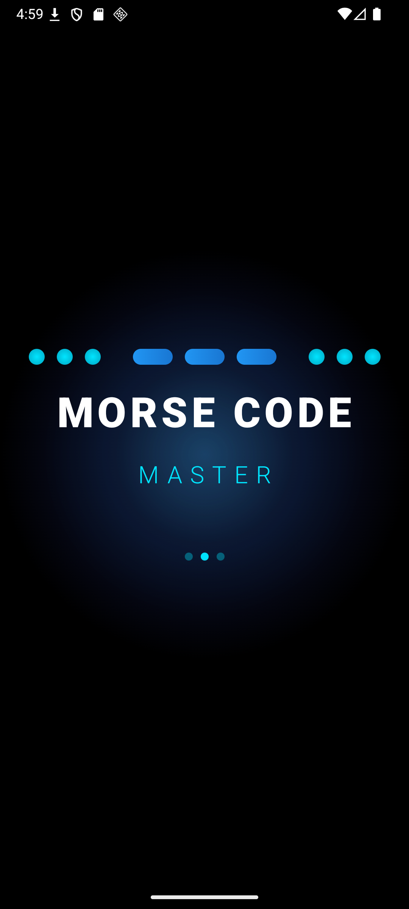
  
</div>

### Bidirectional Translator
<div align="center">
  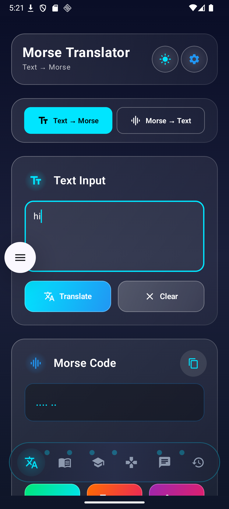
  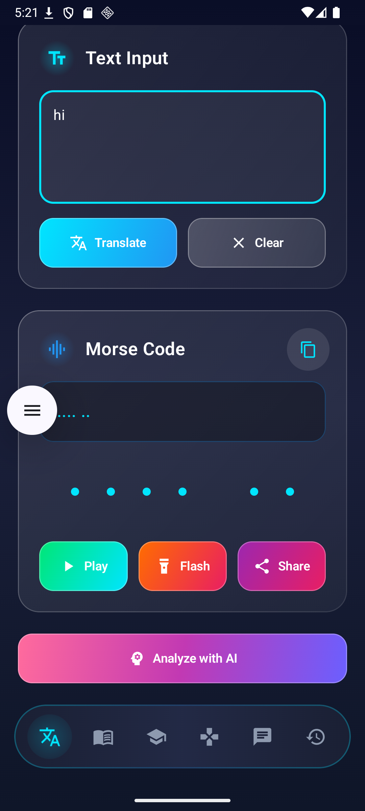
</div>

### Audio & Flash Features
<div align="center">
  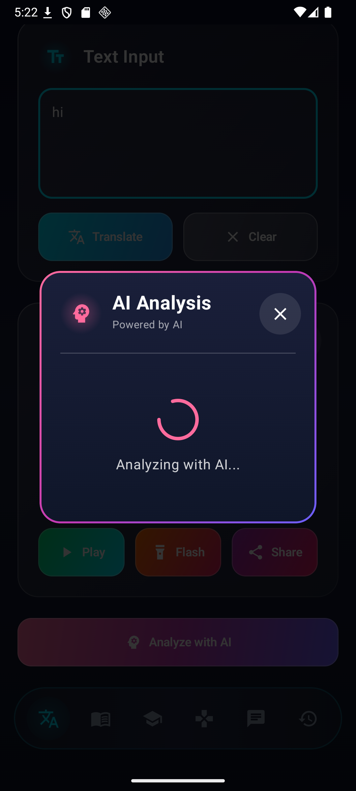
  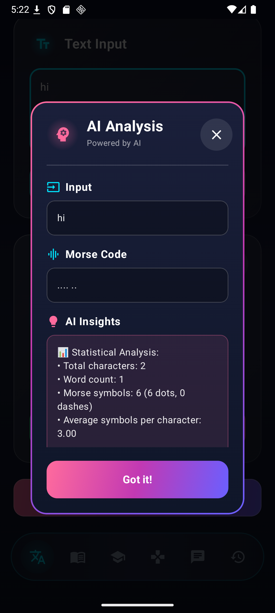
</div>

### Learning & Games
<div align="center">
  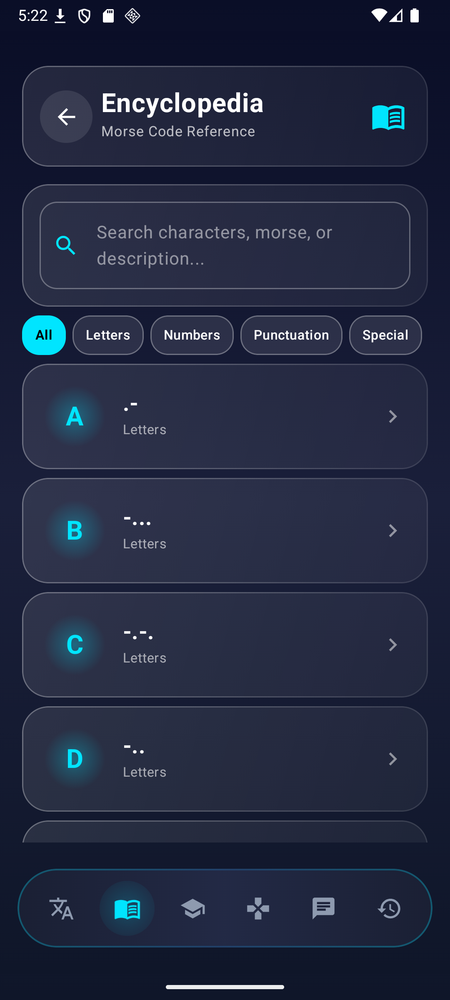
  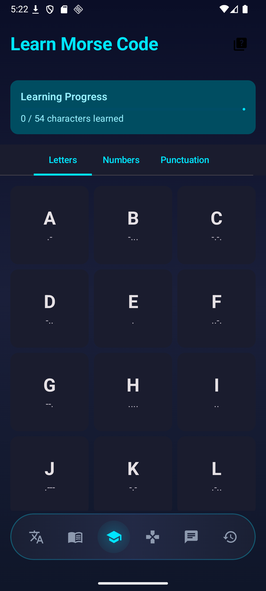
</div>

### Additional Features
<div align="center">
  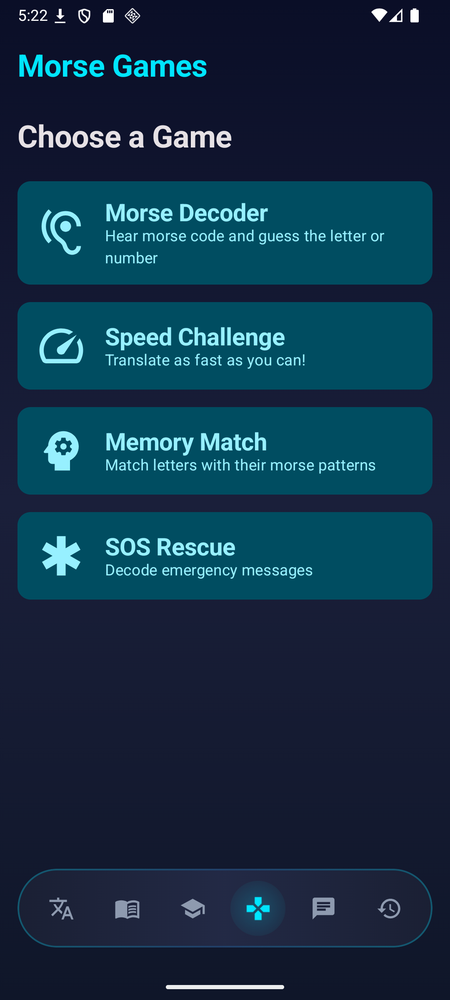
  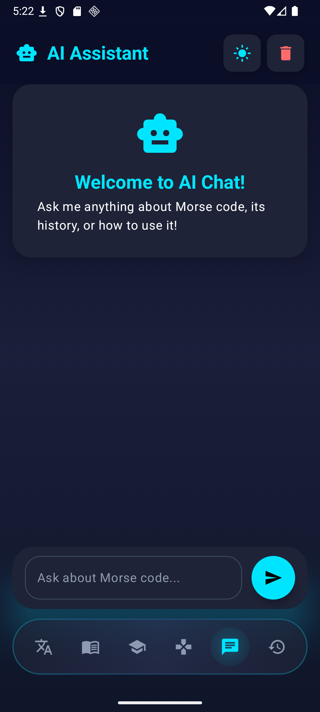
  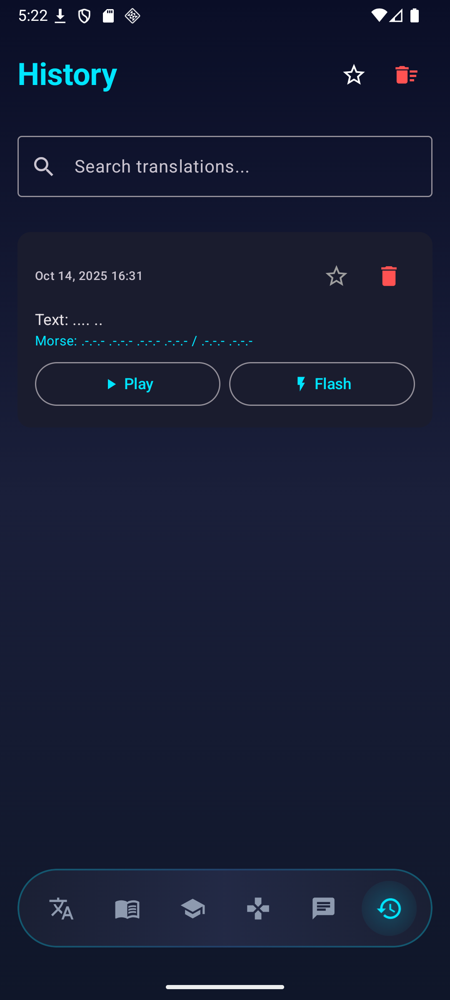
  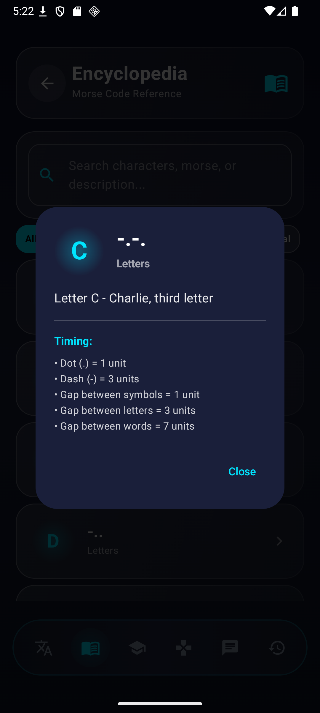
</div>

## Technical Stack

### Architecture
- **Pattern**: MVVM (Model-View-ViewModel)
- **UI Framework**: Jetpack Compose with Material3
- **Navigation**: Jetpack Navigation Component
- **State Management**: StateFlow & Compose State

### Core Technologies
- **Language**: Kotlin
- **Min SDK**: 26 (Android 8.0)
- **Target SDK**: 34 (Android 14)
- **Compile SDK**: 34

### Libraries & Dependencies
- **Jetpack Compose**: Modern declarative UI
- **Room Database**: Local data persistence
- **Retrofit**: REST API client for AI chat
- **OkHttp**: HTTP client with logging
- **Coroutines**: Asynchronous programming
- **DataStore**: Preferences storage
- **Accompanist**: System UI & Permissions
- **Material3**: Latest Material Design components

### Audio & Hardware
- **AudioTrack**: Custom Morse code audio generation
- **SpeechRecognizer**: Voice input processing
- **CameraManager**: Flashlight control
- **MediaPlayer**: Audio playback

## Project Structure

```
app/src/main/java/com/morsecode/app/
├── MainActivity.kt
├── data/
│   ├── local/
│   │   ├── database/
│   │   │   └── MorseDatabase.kt
│   │   ├── dao/
│   │   │   ├── TranslationDao.kt
│   │   │   ├── LearnProgressDao.kt
│   │   │   ├── GameScoreDao.kt
│   │   │   └── ChatMessageDao.kt
│   │   └── entities/
│   │       ├── TranslationEntity.kt
│   │       ├── LearnProgressEntity.kt
│   │       ├── GameScoreEntity.kt
│   │       └── ChatMessageEntity.kt
│   ├── remote/
│   │   ├── PollinationsApiService.kt
│   │   └── ApiClient.kt
│   └── repository/
│       ├── MorseRepository.kt
│       ├── AiChatRepository.kt
│       ├── LearnRepository.kt
│       └── GameRepository.kt
├── domain/
│   ├── MorseTranslator.kt
│   ├── MorseAudioPlayer.kt
│   ├── FlashlightController.kt
│   └── EncryptionManager.kt
├── ui/
│   ├── components/
│   │   ├── MorseVisualizer.kt
│   │   ├── AnimatedButton.kt
│   │   └── PulsingMicrophone.kt
│   ├── navigation/
│   │   └── NavGraph.kt
│   ├── screens/
│   │   ├── TranslatorScreen.kt
│   │   ├── VoiceScreen.kt
│   │   ├── LearnScreen.kt
│   │   ├── GamesScreen.kt
│   │   ├── AiChatScreen.kt
│   │   └── HistoryScreen.kt
│   └── theme/
│       ├── Color.kt
│       ├── Type.kt
│       └── Theme.kt
├── viewmodel/
│   ├── TranslatorViewModel.kt
│   ├── VoiceViewModel.kt
│   ├── LearnViewModel.kt
│   ├── GamesViewModel.kt
│   ├── AiChatViewModel.kt
│   └── HistoryViewModel.kt
└── util/
    ├── Constants.kt
    ├── Extensions.kt
    └── SpeechRecognitionHelper.kt
```

## Setup Instructions

### Prerequisites
- Android Studio Hedgehog (2023.1.1) or later
- JDK 17 or higher
- Android SDK with API level 34
- Gradle 8.2+

### Installation

1. **Clone or Download** the project to your local machine

2. **Open in Android Studio**:
   - File → Open → Select the project directory

3. **Sync Gradle**:
   - Android Studio will automatically sync Gradle files
   - Wait for dependencies to download

4. **Build the Project**:
   - Build → Make Project (Ctrl+F9 / Cmd+F9)

5. **Run the App**:
   - Connect an Android device or start an emulator
   - Run → Run 'app' (Shift+F10 / Ctrl+R)

### Permissions Required

The app requires the following permissions:
- **INTERNET**: For AI chat functionality
- **RECORD_AUDIO**: For voice input feature
- **CAMERA**: For flashlight control
- **FLASHLIGHT**: To use LED for Morse signaling
- **VIBRATE**: For haptic feedback (optional)

All permissions are requested at runtime when needed.

## Features in Detail

### Morse Code Translation
The app uses the International Morse Code standard:
- Letters A-Z
- Numbers 0-9
- Punctuation marks
- Special characters

### Audio Generation
Custom audio synthesis using AudioTrack:
- Frequency: 800 Hz
- Dot duration: 100ms
- Dash duration: 300ms
- Adjustable playback speed

### Encryption Methods

1. **Caesar Cipher**: Shift characters by a fixed number
2. **Reverse**: Reverse the text before encoding
3. **Custom Key**: Substitution cipher with custom alphabet
4. **Combined**: Caesar + Reverse for enhanced security

### AI Integration

The app uses **Pollinations AI** (OpenAI-compatible API):
- Model: `openai` (GPT-based)
- Temperature: 1.0 for balanced responses
- System prompt optimized for Morse code expertise
- No API key required (free tier)

## Theme System

### Light Theme
- Clean white backgrounds
- Blue accent colors (#2196F3)
- Soft shadows and elevation
- High contrast for readability

### Dark Theme
- Deep black backgrounds (#0A0E27)
- Cyan/electric blue accents (#00E5FF)
- Neon glow effects
- Reduced eye strain for night use

Toggle between themes using the settings icon in the top bar.

## Performance Optimizations

- **Lazy Loading**: Efficient list rendering with LazyColumn/Grid
- **State Hoisting**: Minimal recompositions
- **Coroutines**: Non-blocking async operations
- **Room Database**: Efficient local storage with indexing
- **Flow**: Reactive data streams for real-time updates

## Known Limitations

- Flashlight feature requires device with LED flash
- Voice recognition requires internet connection
- AI chat requires internet connection
- Some older devices may not support all audio features

## What's New in Version 1.1.0

✨ **NEW FEATURES:**
- Beautiful onboarding experience for new users
- Comprehensive settings screen with full customization
- Vibration controller for haptic Morse code feedback
- Enhanced Material Design 3 UI with smoother animations
- Improved dark theme with stunning neon effects
- Settings button in translator screen

🔧 **IMPROVEMENTS:**
- Optimized performance and app architecture
- Enhanced audio quality for Morse playback
- Better error handling and user feedback
- Improved navigation flow with settings integration
- More descriptive feature explanations throughout the app

## Future Enhancements

- [ ] Morse code keyboard input
- [x] Vibration patterns for Morse output (Added in v1.1.0)
- [ ] Bluetooth device support
- [ ] Custom sound profiles
- [ ] Social features (share scores)
- [ ] Offline AI mode
- [ ] Widget support
- [ ] Wear OS companion app

## Credits

- **Morse Code Standard**: International Morse Code (ITU-R M.1677-1)
- **AI Provider**: Pollinations.AI
- **Icons**: Material Icons
- **Design**: Material Design 3

## License

This project is provided as-is for educational and personal use.

## Support

For issues, questions, or feature requests, please refer to the project documentation or contact the development team.

---

**Built with ❤️ using Kotlin & Jetpack Compose**
